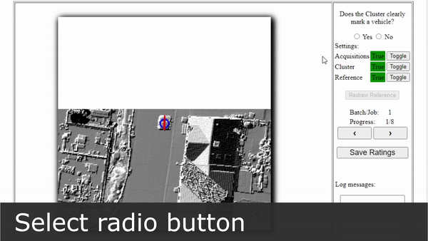

# Masterarbeit
Dieses Verzeichnis enthält ein paar Sourcecodeausschnitte meiner Masterarbeit (Titel: "Entwicklung einer vollautomatisierten Pipeline zur qualitativ hochwertigen Erfassung von Fahrzeugen"). Eine Zusammenfassung mit Bildmaterial gibt es auf der Institutswebsite &rarr; [Link zu Webpräsentation](https://www.ifp.uni-stuttgart.de/lehre/masterarbeiten/615-Stelzer2/).

### Kurzfassung:


> Bei Methoden des Machine Learnings, die auf überwachtem Lernen basieren, werden große Mengen an qualitativ hochwertigen Trainingsdaten benötigt. Die Generierung dieser Daten kann mittels Crowdsourcing realisiert werden. In dieser Masterarbeit wird eine Pipeline für die automatisierte und qualitativ hochwertige Erfassung von Fahrzeugen in 2D-Geodaten entwickelt. Das Ziel ist die Automatisierung des Gesamtprozesses, ausgehend von der Fahrzeugerfassung, bis hin zur leistungsgerechten Bezahlung der Crowdworker. Für die Pipeline wird eine grafische Benutzeroberfläche entwickelt. Mit dieser kann der Administrator Teilschritte der Pipeline ansteuern und den Ablauf kontrollieren. Die Fahrzeugerfassung wird mithilfe der Crowdsourcing-Plattform Microworkers an Crowdworker ausgelagert. Die Integration der erhaltenen Erfassungen ermöglicht eine Unterteilung in korrekte, inkorrekte und unsichere Erfassungen. Bei den unsicheren Erfassungen kann es sich um korrekte oder inkorrekte Erfassungen handeln. Unsichere Erfassungen werden anschließend mittels 2 verschiedener Varianten auf Korrektheit überprüft. Für beide Varianten wird jeweils ein Webinterface entwickelt. Bei der ersten Variante wird die Überprüfung an Crowdworker ausgelagert. Mithilfe eines Fragebogens wird die Lage und Orientierung einzelner, unsicherer Erfassungen, in Bezug zu einem erfassten Fahrzeug, bestimmt. Die erneute Auslagerung an Crowdworker ermöglicht die Automatisierbarkeit der Pipeline. Bei der zweiten Variante erfolgt die Überprüfung manuell durch den Administrator. Diese Variante dient als Vergleichswert. Das Ergebnis der Überprüfung entspricht einer Einteilung der unsicheren Erfassungen, in qualitativ hoch- und minderwertige Erfassungen, also korrekte und inkorrekte Erfassungen. Ausgehend davon können die Crowdworker der ersten Crowdsourcing-Kampagne, der Leistung entsprechend bezahlt werden. Das bedeutet, dass ausschließlich Crowdworker bezahlt werden, die Fahrzeuge überwiegend korrekt erfassen. Die Analyse der erhaltenen, integrierten Daten ergibt, dass eine vollautomatisierte und qualitativ hochwertige Erfassung von Fahrzeugen möglich ist.

### Grafische Darstellung der Pipeline:

<p align="center"></p>

### GUI:

Die fertige Oberfläche (```gui_main.py```) mit deren Hilfe die einzelnen Pipelineschritte gesteuert werden können ist in der folgenden Abbildung zu sehen. Die Pipeline wird durchlaufen, indem die Schritte 1-13 nacheinander abgearbeitet werden. Die einzelnen Funktionen sind in der ```functionLibrary.py``` zu finden:

<p align="center"></p>

### Datenaustausch zwischen den beteiligten Plattformen:

Der Datenaustausch zwischen dem lokalen System, dem Webserver und der Crowdsourcing Plattform Microworkers.com ist im nachfolgenden Schema dargestellt:

<p align="center"></p>

### Admin-Webinterface

Das Webinterface ist im Ordner ```admin_webinterface``` zu finden und basiert auf den Standard Webtechnologien HTML, JS und PHP. Das Interface ermöglicht die Überprüfung von Erfassungen durch den Admin. Der Ablauf ist im folgenden dargestellt:
1. Erfassungen (Rote Linien) eines unsicheren Clusters (Blauer Kreis) werden im zugehörigen Bildausschnitt dargestellt.
2. Der Administrator entscheidet ob das Cluster ein Fahrzeug markiert.
3. Wenn es sich um ein Fahrzeug handelt, erfasst der Administrator manuell das Fahrzeug neu und setzt damit eine Referenzerfassung (Gelbe Linie). Diese wird später als Vergleichswert verwendet, um zu entscheiden, ob eine einzelne Erfassung des dargestellten Clusters korrekt oder inkorrekt ist.

<p align="center">

</p>


